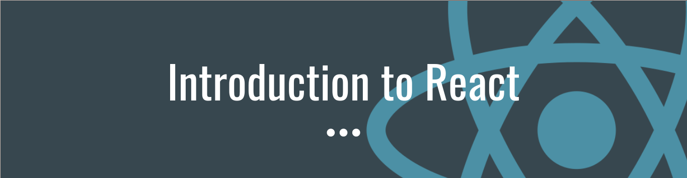

This is a simple TODO application that I built to teach the basics of React in the Computer Science Club at IUPUI.
I began by using the React, React-dom, and Babel CDNs to create a `Hello World` component in a standalone HTML file.

After, I used [Create React App](https://github.com/facebook/create-react-app) to bootstrap my TODO application.
When the TODO application was functional, I deployed it using [ZEIT](https://zeit.co).

See the slides for the Intro to React presentation [here](https://docs.google.com/presentation/d/1tfpYTlKZwPRQiQIxjUjzSn9AxeWPbxd61PPKZiLegxk/edit?usp=sharing)! Additionally, checkout the React [website](https://reactjs.org/) for more information and some great tutorials.
